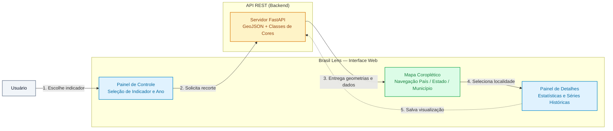

# Brasil Lens — Interface Web (Frontend)

O **Brasil Lens** é uma aplicação web interativa que transforma dados públicos de demografia, economia e meio ambiente do Brasil em mapas temáticos fáceis de explorar e compreender.

Este repositório contém o **código da interface de usuário (SPA)** desenvolvida em React, TypeScript e Leaflet, responsável por desenhar o mapa, aplicar cores proporcionais aos indicadores e oferecer controles intuitivos para navegação.

---

## Como a Aplicação Funciona

O propósito da interface é permitir que qualquer usuário visualize a realidade dos estados e municípios brasileiros sem precisar lidar com tabelas complexas ou termos técnicos.



1. **Escolha de Indicadores:** O usuário escolhe o que deseja analisar (por exemplo: população, PIB per capita, desemprego, temperatura ou focos de queimada).
2. **Navegação Visual:** O mapa se colore automaticamente de acordo com os valores de cada região. Clicar duas vezes em um estado aproxima a câmera e revela todos os seus municípios.
3. **Resumo e Marcadores:** Ao clicar em um município, abre-se um painel com os dados completos e o usuário pode salvar aquele recorte de visualização para consultar quando quiser.

---

## Estrutura de Containers (Docker)

Para atender a todos os requisitos de entrega e avaliação:

- **Dockerfile da Interface:** Localizado na raiz deste repositório ([`Dockerfile`](Dockerfile)), configurado com build multi-etapas (Node 22 para compilação e Nginx Alpine leve para servir os arquivos estáticos).
- **Docker Compose da Interface:** Localizado na raiz deste repositório ([`docker-compose.yml`](docker-compose.yml)), permitindo subir a interface web isoladamente com um único comando. *(Nota: a solução completa integrada com banco e API também pode ser iniciada a partir do repositório da API).*

---

## Instruções de Instalação e Execução

### Opção 1: Execução com Docker e Docker Compose (Recomendado)

Constrói a aplicação e a disponibiliza através de um servidor Nginx:

#### 1. Clonar o repositório
```bash
git clone https://github.com/henriquexaud/brasil-lens-frontend.git
cd brasil-lens-frontend
```

#### 2. Subir o container
```bash
docker compose up --build --wait
```
*Acesse a interface no navegador:* [`http://localhost:5173`](http://localhost:5173)

> **Atenção:** Para que o mapa carregue as informações, certifique-se de que a API backend esteja em execução na porta `8000`. Para rodar a aplicação completa (banco, api e frontend) conjuntamente, consulte o repositório principal: [`brasil-lens-backend`](https://github.com/henriquexaud/brasil-lens-backend).

Para parar o container:
```bash
docker compose down
```

---

### Opção 2: Instalação Local com Node.js (Ambiente de Desenvolvimento)

Para executar com recarga em tempo real durante o desenvolvimento:

#### 1. Pré-requisitos
- Node.js instalado (versão 20 ou superior, recomendada 22)
- Gerenciador de pacotes `npm`

#### 2. Instalar as dependências
```bash
npm install
```

#### 3. Iniciar o servidor de desenvolvimento
```bash
npm run dev
```
*Acesse no navegador através do endereço:* [`http://localhost:5173`](http://localhost:5173)

---

## Scripts Disponíveis

| Comando | Descrição |
|---|---|
| `npm run dev` | Inicia o servidor local de desenvolvimento com hot-reload |
| `npm run build` | Compila o projeto em TypeScript e gera os arquivos finais de produção na pasta `dist/` |
| `npm run lint` | Executa o linter ESLint e validação estrita de tipos do TypeScript |
| `npm test` | Executa os testes automatizados da interface |
| `npm run format` | Formata todo o código-fonte automaticamente com Prettier |

---

## Configuração (Variáveis de Ambiente)

Para alterar a porta ou o endereço da API consumida pela interface, copie o arquivo [`.env.example`](.env.example) para `.env`:

| Variável | Valor Padrão | Para que serve |
|---|---|---|
| `VITE_API_BASE_URL` | `http://localhost:8000/api/v1` | Endereço da API REST utilizado pelo navegador |
| `WEB_PORT` | `5173` | Porta local publicada no Docker Compose |

> **Nota:** As variáveis iniciadas por `VITE_` são incorporadas ao código durante o processo de compilação (*build*). Se você alterar a URL da API no `.env`, reconstrua o projeto com `npm run build` ou `docker compose up --build`.

---

## Documentação Técnica Detalhada

Os detalhes de implementação, arquitetura interna e padrões visuais estão documentados na pasta [`docs/`](docs/):

- 🏛️ [**Arquitetura do Frontend (`docs/ARCHITECTURE.md`)**](docs/ARCHITECTURE.md): Organização das pastas por funcionalidades (*features*), gerenciamento de estado assíncrono com TanStack Query e estratégias de performance.
- 🗺️ [**Camadas e Recursos do Mapa (`docs/FEATURES_AND_LAYERS.md`)**](docs/FEATURES_AND_LAYERS.md): Como funcionam as camadas de indicadores, carregamento em duas etapas (LOD), clima e focos de calor.
- 🔌 [**Integração com a API (`docs/API_INTEGRATION.md`)**](docs/API_INTEGRATION.md): Como a interface se comunica com o backend, tipagem estrita de dados e tratamento de erros.
- 🎨 [**Sistema de Cores Cartográficas (`docs/COLOR_SYSTEM.md`)**](docs/COLOR_SYSTEM.md): Definição das paletas cromáticas por contexto temático e acessibilidade.
