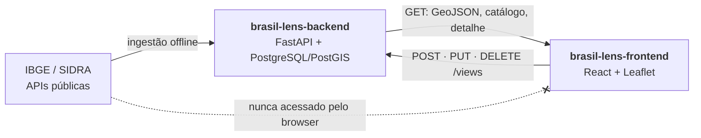

# Brasil Lens — frontend

Mapa coroplético interativo do Brasil: escolha um indicador e um ano, passe o
cursor sobre os estados, abra um estado para ver os municípios e salve os
recortes que quiser rever.

A API, o banco e a ingestão dos dados do IBGE estão no repositório principal,
**[brasil-lens-backend](https://github.com/henriquexaud/brasil-lens-backend)** —
que também sobe este frontend com um único comando.

**Princípio central:** o browser nunca fala com o IBGE. Todo dado vem da API do
projeto, que entrega GeoJSON já com valor, estatística e classes de coropleta —
este frontend renderiza sem transformar.

---

## Como rodar

### Aplicação completa (recomendado)

Banco + API + este frontend, a partir do repositório do backend — não é preciso
clonar este repositório:

```bash
git clone https://github.com/henriquexaud/brasil-lens-backend.git
cd brasil-lens-backend
docker compose up --build --wait
docker compose run --rm api python -m app.jobs.bootstrap    # dados do IBGE (~10 min, só na 1ª vez)
```

Abra <http://localhost:5173>.

### Só o frontend, com Docker

Com a API já no ar em `http://localhost:8000` (no backend:
`docker compose up --build --wait db api`):

```bash
git clone https://github.com/henriquexaud/brasil-lens-frontend.git
cd brasil-lens-frontend
docker compose up --build --wait     # http://localhost:5173
```

### Desenvolvimento, com Node

Requer Node 20+ (a imagem usa 22). Recarrega o navegador a cada edição:

```bash
npm install
npm run dev      # http://localhost:5173
```

---

## Arquitetura



O diagrama completo, com as camadas do backend, está no
[README do backend](https://github.com/henriquexaud/brasil-lens-backend#arquitetura).

Stack: React 18 · Vite 6 · TypeScript 5.7 (strict) · TanStack Query 5 ·
Leaflet 1.9 · react-leaflet 4. Versões fixadas em [`package.json`](package.json).

Não há Redux nem store global: o único estado difícil do produto são respostas
de servidor cacheadas por (indicador, ano, escopo), que é exatamente o que o
TanStack Query resolve. O estado de interface (indicador escolhido, território
selecionado) mora em `useState` e em hooks locais.

---

## Configuração

Tudo tem default; para mudar, copie [`.env.example`](.env.example) para `.env`.

| Variável | Default | Observação |
|---|---|---|
| `VITE_API_BASE_URL` | `http://localhost:8000/api/v1` | URL da API usada pelo **navegador** |
| `WEB_PORT` | `5173` | porta publicada pelo `docker-compose.yml` |

O Vite resolve `import.meta.env.VITE_*` em tempo de **build**: a URL é assada no
bundle. Mudá-la exige reconstruir (`docker compose up --build` ou
`npm run build`) — editar o `.env` com o bundle pronto não tem efeito. No
Docker, ela entra como `--build-arg`.

A API precisa listar a origem deste frontend em `CORS_ORIGINS` (o default do
backend já inclui `http://localhost:5173`), senão o navegador recusa
`POST`/`PUT`/`DELETE` já no preflight.

---

## O que o frontend consome

| Método | Rota | Onde |
|---|---|---|
| `GET` | `/map?level=&parent=&indicator=&year=` | camada do mapa (`useMapLayer`) |
| `GET` | `/indicators?level=` | seletores de indicador e ano (`useIndicators`) |
| `GET` | `/territories/{code}/overview` | painel de detalhe (`useTerritoryOverview`) |
| `GET` | `/territories?level=state` | nomes das UFs nas visualizações (`useTerritories`) |
| `GET` | `/views` | lista de visualizações salvas (`useSavedViews`) |
| `POST` | `/views` | "Salvar atual" (`useCreateSavedView`) |
| `PUT` | `/views/{id}` | renomear (`useUpdateSavedView`) |
| `DELETE` | `/views/{id}` | excluir, com confirmação (`useDeleteSavedView`) |

`src/api/client.ts` é o único lugar que conhece URLs; `src/api/types.ts` espelha
os schemas Pydantic do backend à mão, sem `any`, para uma mudança de contrato
aparecer na compilação e não em runtime.

Nenhuma escrita é otimista: cada mutação invalida a lista e a interface passa a
refletir o banco. Em uma lista de marcadores, mostrar uma linha que o servidor
recusou seria pior que esperar 40 ms.

---

## Estrutura

```
src/
  api/                client.ts (fetch + erros tipados), queries.ts (hooks), types.ts
  components/         Select.tsx, Feedback.tsx
  features/
    map/              MapView.tsx, ChoroplethLayer.tsx, Legend.tsx, colors.ts, useMapScope.ts
    controls/         ControlPanel.tsx — filtros de indicador e ano
    detail/           TerritoryDetailPanel.tsx
    views/            SavedViewsPanel.tsx — o CRUD de visualizações
  lib/format.ts       formatação pt-BR (números, moeda, unidades)
  styles.css          um único arquivo, com tokens em :root
  App.tsx, main.tsx
Dockerfile            build do Vite + nginx
nginx.conf            SPA fallback e cache dos assets com hash
docker-compose.yml    sobe só este frontend
```

Convenções: **componentes React em `PascalCase`** (arquivo e símbolo); hooks e
utilitários em `camelCase`; um diretório por *feature*, não por tipo de arquivo.

---

## Qualidade

```bash
npm run lint      # eslint + tsc --noEmit
npm run format    # prettier
npm run build     # tsc -b && vite build
```

TypeScript roda em `strict`, com `noUnusedLocals`, `noUncheckedIndexedAccess` e
`verbatimModuleSyntax`.
