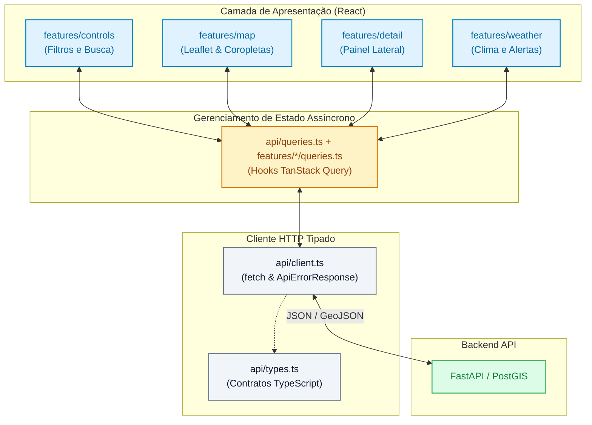

# Arquitetura do Frontend — Brasil Lens

Este documento apresenta os princípios de engenharia, arquitetura de componentes, gerenciamento de estado e otimizações de performance aplicados no frontend do **Brasil Lens**.

---

## 1. Visão Geral e Princípios

O frontend foi desenhado sob um princípio central: **o navegador nunca interage diretamente com provedores externos de dados (IBGE, Open-Meteo, INPE, etc.)**. Todas as consultas passam pela API do projeto, que já devolve estruturas GeoJSON padronizadas, com valores calculados, classes de coropleta e limites numéricos prontos para renderização.

### Stack Tecnológico

- **Framework & UI:** React 18 + TypeScript 5.7 (em modo `strict`)
- **Build Tool:** Vite 6
- **Cartografia:** Leaflet 1.9 + React-Leaflet 4
- **Gerenciamento de Estado Assíncrono:** TanStack Query v5 (React Query)
- **Servidor Web em Produção:** Nginx 1.27 Alpine (imagem com menos de 60 MB)

---

## 2. Gerenciamento de Estado

Uma das decisões chave de arquitetura foi **não utilizar gerenciadores globais complexos como Redux ou Zustand**.

O produto possui duas categorias distintas de estado:

1. **Estado de Servidor (Dados Assíncronos):** Respostas cacheadas e indexadas por escopo `(indicador, ano, território)`. O **TanStack Query** resolve nativamente o ciclo de vida desses dados: cache automático, invalidação inteligente, deduplicação de requisições simultâneas e retentativas em caso de falhas de rede.
2. **Estado de Interface (UI Local):** Seleção atual de indicador, filtros de busca e visibilidade de painéis. Gerenciados através de hooks padrão do React (`useState`, `useCallback`, `useMemo`) e hooks customizados situados junto às respectivas funcionalidades.

---

## 3. Organização por Features e Fluxo de Componentes

O código-fonte sob `src/` adota o padrão de organização por domínio funcional (*feature-driven*):



Estrutura de diretórios:

```
frontend/src/
├── api/                    # Cliente HTTP, contratos, chaves e ciclo de vida das consultas compartilhadas
├── app/                    # Preferências persistidas e seleção da camada temática
├── components/             # Componentes genéricos e reutilizáveis (Select, Feedback, Modais)
├── features/
│   ├── controls/           # Painel de controle superior (seleção de indicadores, anos e busca)
│   ├── detail/             # Painel lateral com resumo e séries históricas do território selecionado
│   ├── follow/             # Painel e consultas de municípios seguidos
│   ├── map/                # Malha, seleção territorial, interações Leaflet e tooltip
│   ├── views/              # Painel e consultas de visualizações salvas (CRUD)
│   └── weather/            # Consultas climáticas, composição das leituras e apresentação
├── lib/                    # Funções utilitárias (formatação pt-BR de números, moedas e unidades)
├── App.tsx                 # Composição central da aplicação
├── main.tsx                # Ponto de entrada React com QueryClientProvider
└── styles.css              # Sistema coeso de estilos via CSS custom properties (design tokens)
```

`App.tsx` coordena o fluxo entre domínios. `useTerritoryMap` prepara a malha e a seleção antes de habilitar as camadas temáticas; `useWeatherMapData` combina as respostas climáticas já disponíveis para o mapa. As preferências ficam em `useAppPreferences`. Consultas com regras próprias ficam junto das funcionalidades (`weather/queries.ts`, `views/useSavedViews.ts` e `follow/useFollowedMunicipalities.ts`); `api/queries.ts` preserva as exportações públicas existentes para consumidores e testes. `queryKeys.ts` centraliza as chaves compartilhadas e `queryLifecycle.ts` contém apenas os efeitos comuns de cancelamento e paginação.

`WeatherPanel` compõe o detalhe selecionado; previsão e cartões de estado de fogo/chuva são componentes de apresentação separados. `ChoroplethLayer` mantém os eventos e estilos Leaflet, enquanto `territoryTooltip.ts` constrói somente o conteúdo textual do tooltip.

---

## 4. Otimização de Performance e Bundle

1. **Code-Splitting e Lazy Loading:** Componentes secundários ou acionados apenas sob demanda (como o painel de visualizações salvas e detalhes climáticos estendidos) são carregados de forma assíncrona com `React.lazy()` e `Suspense`.
2. **Separação de Chunks (Vendor Chunking):** A configuração do Vite (`vite.config.ts`) separa dependências pesadas (`react`, `react-dom`, `leaflet`, `@tanstack/react-query`) em chunks independentes, maximizando o reaproveitamento do cache do navegador entre versões da aplicação.
3. **Nginx com Cache Estratégico:** No container de produção, o `nginx.conf` define cabeçalhos de expiração longa (`Cache-Control: public, max-age=31536000, immutable`) para arquivos com hash no nome (`dist/assets/`), enquanto o `index.html` nunca é cacheado para garantir atualizações instantâneas.
